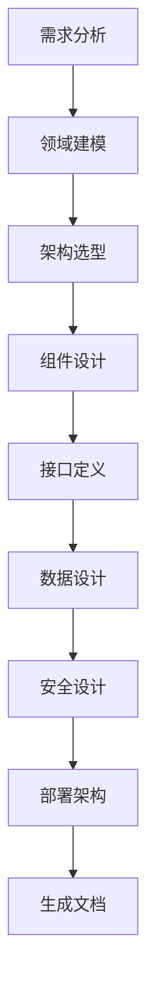
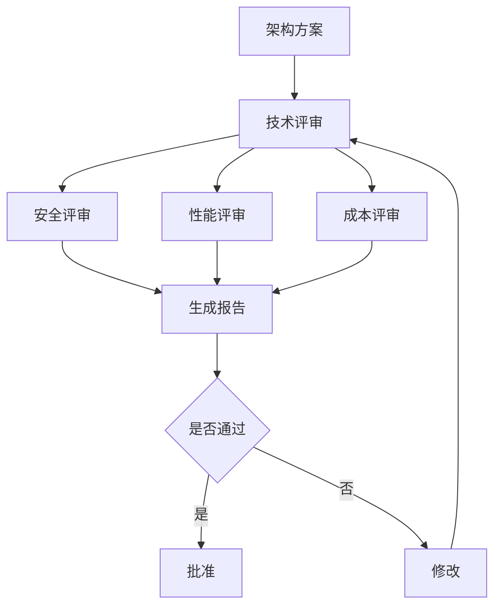
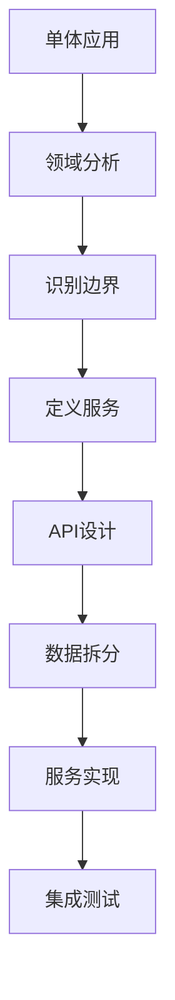
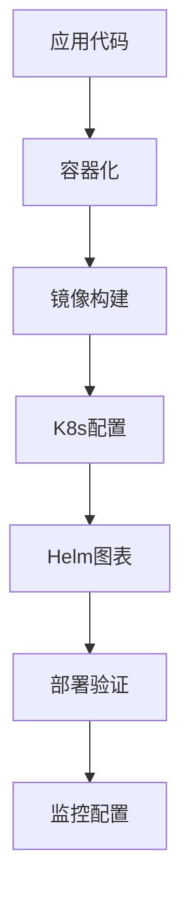
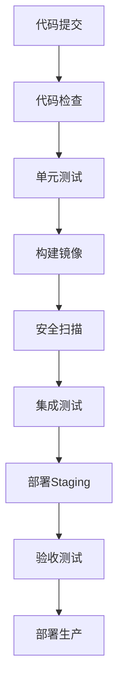

# Workflows 工作流 - 架构设计

> 系统架构、微服务、云原生、DevOps 的工作流

---

## 🏗️ 系统架构工作流

### 完整架构设计流程



**工作流定义：**
```yaml
workflow:
  name: "SystemArchitectureDesign"
  description: "完整系统架构设计流程"
  type: "dag"
  
  steps:
    - id: "requirements_analysis"
      name: "需求分析"
      skill: "RequirementsAnalyzer"
      input: "{{business_requirements}}"
      output: "system_requirements"
    
    - id: "domain_modeling"
      name: "领域建模"
      skill: "DomainModeler"
      input: "{{system_requirements}}"
      output: "domain_model"
    
    - id: "architecture_selection"
      name: "架构选型"
      skill: "TechStackSelector"
      inputs:
        - "{{system_requirements}}"
        - "{{constraints}}"
      output: "architecture_style"
    
    - id: "component_design"
      name: "组件设计"
      skill: "SystemArchitect"
      inputs:
        - "{{domain_model}}"
        - "{{architecture_style}}"
      output: "component_diagram"
    
    - id: "api_design"
      name: "API设计"
      skill: "APIDesigner"
      input: "{{component_diagram}}"
      output: "api_specification"
    
    - id: "data_architecture"
      name: "数据架构"
      skill: "DatabaseArchitect"
      input: "{{domain_model}}"
      output: "data_model"
    
    - id: "security_design"
      name: "安全设计"
      skill: "AuthDesigner"
      input: "{{component_diagram}}"
      output: "security_scheme"
    
    - id: "deployment_architecture"
      name: "部署架构"
      skill: "DeploymentStrategist"
      inputs:
        - "{{component_diagram}}"
        - "{{constraints.infrastructure}}"
      output: "deployment_architecture"
    
    - id: "c4_modeling"
      name: "C4建模"
      skill: "C4Modeler"
      inputs:
        - "{{system_requirements}}"
        - "{{component_diagram}}"
        - "{{deployment_architecture}}"
      output: "c4_model"
    
    - id: "documentation"
      name: "生成文档"
      skill: "ArchitectureDocumenter"
      inputs:
        - "{{c4_model}}"
        - "{{api_specification}}"
        - "{{data_model}}"
        - "{{security_scheme}}"
      output: "architecture_document"
```

### 架构评审流程



---

## ☸️ 微服务工作流

### 微服务拆分流程



**工作流定义：**
```yaml
workflow:
  name: "MicroservicesMigration"
  description: "单体到微服务迁移"
  
  steps:
    - name: "代码分析"
      skill: "CodeAnalyzer"
      input: "{{monolith_code}}"
      output: "code_structure"
    
    - name: "领域建模"
      skill: "DomainModeler"
      input: "{{business_domain}}"
      output: "domain_model"
    
    - name: "服务拆分"
      skill: "ServiceDecomposer"
      inputs:
        - "{{code_structure}}"
        - "{{domain_model}}"
      output: "service_boundaries"
    
    - name: "API设计"
      skill: "APIDesigner"
      input: "{{service_boundaries}}"
      output: "api_definitions"
    
    - name: "数据拆分"
      skill: "DataPartitioner"
      inputs:
        - "{{database_schema}}"
        - "{{service_boundaries}}"
      output: "data_strategy"
    
    - name: "服务实现"
      skill: "ServiceGenerator"
      inputs:
        - "{{api_definitions}}"
        - "{{code_structure}}"
      output: "service_code"
    
    - name: "网关配置"
      skill: "APIGatewayDesigner"
      input: "{{api_definitions}}"
      output: "gateway_config"
    
    - name: "服务网格"
      skill: "ServiceMeshPlanner"
      input: "{{service_boundaries}}"
      output: "mesh_config"
    
    - name: "监控配置"
      skill: "MonitoringDesigner"
      input: "{{service_boundaries}}"
      output: "monitoring_setup"
```

### 服务治理流程

```yaml
workflow:
  name: "ServiceGovernance"
  description: "微服务治理"
  
  steps:
    - parallel:
        - name: "服务注册"
          skill: "ServiceRegistry"
          output: "registry_config"
        
        - name: "负载均衡"
          skill: "LoadBalancer"
          output: "lb_config"
        
        - name: "熔断配置"
          skill: "CircuitBreaker"
          output: "circuit_breaker_config"
        
        - name: "限流配置"
          skill: "RateLimiter"
          output: "rate_limit_config"
    
    - name: "集成治理"
      skill: "GovernanceIntegrator"
      inputs:
        - "{{registry_config}}"
        - "{{lb_config}}"
        - "{{circuit_breaker_config}}"
        - "{{rate_limit_config}}"
      output: "governance_policy"
```

---

## ☁️ 云原生工作流

### K8s部署流程



**工作流定义：**
```yaml
workflow:
  name: "KubernetesDeployment"
  description: "云原生部署流程"
  
  steps:
    - name: "Dockerfile生成"
      skill: "Containerizer"
      input: "{{application}}"
      output: "dockerfile"
    
    - name: "镜像构建"
      skill: "ImageBuilder"
      input: "{{dockerfile}}"
      output: "docker_image"
    
    - name: "K8s配置"
      skill: "K8sManifestGenerator"
      inputs:
        - "{{application}}"
        - "{{docker_image}}"
      output: "k8s_manifests"
    
    - name: "Helm图表"
      skill: "HelmChartCreator"
      input: "{{k8s_manifests}}"
      output: "helm_chart"
    
    - name: "配置管理"
      skill: "ConfigMapGenerator"
      input: "{{application.config}}"
      output: "configmap"
    
    - name: "密钥管理"
      skill: "SecretManager"
      input: "{{application.secrets}}"
      output: "secrets"
    
    - name: "监控配置"
      skill: "MonitoringDesigner"
      input: "{{application}}"
      output: "monitoring_config"
    
    - name: "日志配置"
      skill: "LoggingPlanner"
      input: "{{application}}"
      output: "logging_config"
    
    - name: "部署验证"
      skill: "DeploymentValidator"
      inputs:
        - "{{helm_chart}}"
        - "{{monitoring_config}}"
      output: "deployment_status"
```

### 可观测性配置流程

```yaml
workflow:
  name: "ObservabilitySetup"
  description: "可观测性配置"
  
  steps:
    - parallel:
        - name: "指标监控"
          skill: "MonitoringDesigner"
          output: "metrics_config"
        
        - name: "日志收集"
          skill: "LoggingPlanner"
          output: "logging_config"
        
        - name: "链路追踪"
          skill: "TracingImplementer"
          output: "tracing_config"
    
    - name: "告警规则"
      skill: "AlertingConfigurator"
      inputs:
        - "{{metrics_config}}"
        - "{{logging_config}}"
      output: "alert_rules"
    
    - name: "仪表盘"
      skill: "DashboardDesigner"
      inputs:
        - "{{metrics_config}}"
        - "{{alert_rules}}"
      output: "dashboards"
```

---

## 🔄 DevOps工作流

### CI/CD流水线



**工作流定义：**
```yaml
workflow:
  name: "CICDPipeline"
  description: "完整CI/CD流水线"
  
  steps:
    - name: "代码检查"
      skill: "CodeQualityChecker"
      input: "{{source_code}}"
      output: "quality_report"
    
    - name: "安全扫描"
      skill: "SecurityScanner"
      input: "{{source_code}}"
      output: "security_report"
    
    - name: "单元测试"
      skill: "UnitTestRunner"
      input: "{{source_code}}"
      output: "test_results"
    
    - name: "构建镜像"
      skill: "ImageBuilder"
      input: "{{source_code}}"
      output: "docker_image"
    
    - name: "镜像扫描"
      skill: "ImageScanner"
      input: "{{docker_image}}"
      output: "scan_results"
    
    - name: "集成测试"
      skill: "IntegrationTestRunner"
      inputs:
        - "{{docker_image}}"
        - "{{test_environment}}"
      output: "integration_results"
    
    - name: "部署Staging"
      skill: "K8sDeployer"
      inputs:
        - "{{docker_image}}"
        - "{{staging_config}}"
      output: "staging_deployment"
    
    - name: "验收测试"
      skill: "AcceptanceTestRunner"
      input: "{{staging_deployment}}"
      output: "acceptance_results"
    
    - name: "部署生产"
      skill: "K8sDeployer"
      inputs:
        - "{{docker_image}}"
        - "{{production_config}}"
      output: "production_deployment"
    
    - name: "监控验证"
      skill: "DeploymentMonitor"
      input: "{{production_deployment}}"
      output: "monitoring_status"
```

### IaC配置流程

```yaml
workflow:
  name: "InfrastructureAsCode"
  description: "基础设施即代码"
  
  steps:
    - name: "基础设施分析"
      skill: "InfrastructureAnalyzer"
      input: "{{requirements}}"
      output: "infrastructure_spec"
    
    - name: "Terraform代码"
      skill: "TerraformWriter"
      input: "{{infrastructure_spec}}"
      output: "terraform_code"
    
    - name: "Ansible剧本"
      skill: "AnsiblePlaybook"
      input: "{{infrastructure_spec}}"
      output: "ansible_playbooks"
    
    - name: "K8s配置"
      skill: "K8sManifestGenerator"
      input: "{{infrastructure_spec}}"
      output: "k8s_configs"
    
    - name: "安全加固"
      skill: "SecurityHardening"
      inputs:
        - "{{terraform_code}}"
        - "{{k8s_configs}}"
      output: "hardened_configs"
    
    - name: "成本优化"
      skill: "CostOptimizer"
      input: "{{terraform_code}}"
      output: "optimized_configs"
```

---

## 🔐 安全架构工作流

### 零信任架构

```yaml
workflow:
  name: "ZeroTrustArchitecture"
  description: "零信任安全架构"
  
  steps:
    - name: "身份认证"
      skill: "AuthDesigner"
      output: "auth_scheme"
    
    - name: "微分段"
      skill: "NetworkPolicy"
      output: "network_policies"
    
    - name: "密钥管理"
      skill: "SecretManager"
      output: "secret_management"
    
    - name: "运行时安全"
      skill: "RuntimeSecurity"
      output: "runtime_policies"
    
    - name: "审计日志"
      skill: "AuditLogger"
      output: "audit_config"
```

---

## 📊 数据架构工作流

### 数据平台构建

```yaml
workflow:
  name: "DataPlatform"
  description: "数据平台构建"
  
  steps:
    - name: "数据建模"
      skill: "DataModeler"
      output: "data_models"
    
    - name: "数据仓库"
      skill: "DataWarehouse"
      output: "warehouse_schema"
    
    - name: "数据管道"
      skill: "PipelineDesigner"
      output: "data_pipelines"
    
    - name: "流处理"
      skill: "StreamProcessor"
      output: "streaming_jobs"
    
    - name: "数据质量"
      skill: "DataQuality"
      output: "quality_rules"
    
    - name: "数据治理"
      skill: "DataGovernance"
      output: "governance_policies"
```

---

## 🎯 综合工作流

### 全栈云原生应用

```yaml
workflow:
  name: "FullStackCloudNative"
  description: "完整云原生应用开发"
  
  steps:
    - name: "架构设计"
      skill: "SystemArchitect"
      output: "architecture"
    
    - name: "微服务设计"
      skill: "ServiceDecomposer"
      output: "services"
    
    - name: "API设计"
      skill: "APIDesigner"
      output: "apis"
    
    - name: "前端开发"
      skill: "FrontendGenerator"
      output: "frontend"
    
    - name: "后端开发"
      skill: "BackendGenerator"
      output: "backend"
    
    - name: "容器化"
      skill: "Containerizer"
      output: "dockerfiles"
    
    - name: "K8s部署"
      skill: "K8sManifestGenerator"
      output: "k8s_configs"
    
    - name: "CI/CD"
      skill: "PipelineDesigner"
      output: "pipelines"
    
    - name: "监控"
      skill: "MonitoringDesigner"
      output: "monitoring"
    
    - name: "安全"
      skill: "SecurityHardening"
      output: "security"
```

---

## 📋 模板

### 快速创建微服务

```yaml
template:
  name: "QuickMicroservice"
  description: "快速创建微服务"
  
  parameters:
    - name: "service_name"
      type: "string"
      required: true
    
    - name: "language"
      type: "enum"
      options: ["java", "go", "python", "nodejs"]
      default: "java"
  
  workflow:
    - skill: "ServiceGenerator"
      input: "{{service_name}}"
      config:
        language: "{{language}}"
    
    - skill: "DockerfileGenerator"
    
    - skill: "K8sManifestGenerator"
    
    - skill: "APIDesigner"
```

---

*持续更新中...*
