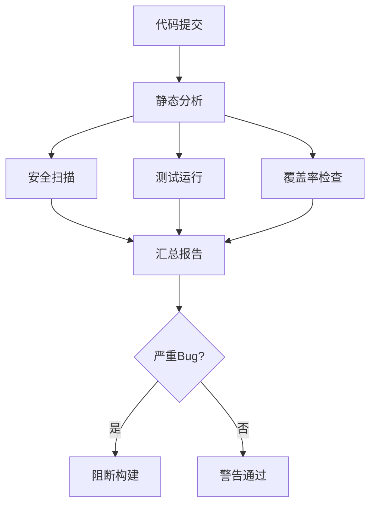
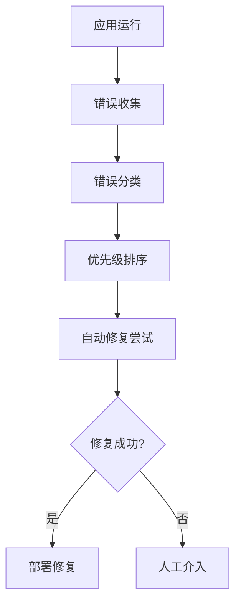
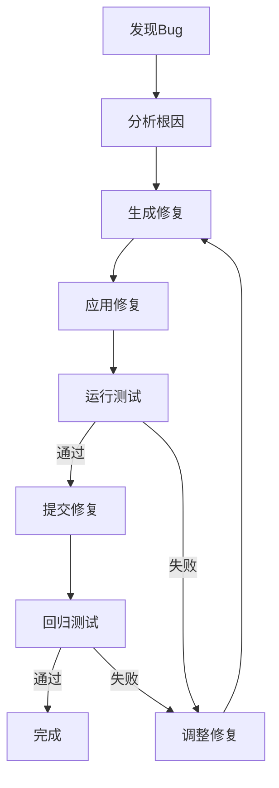
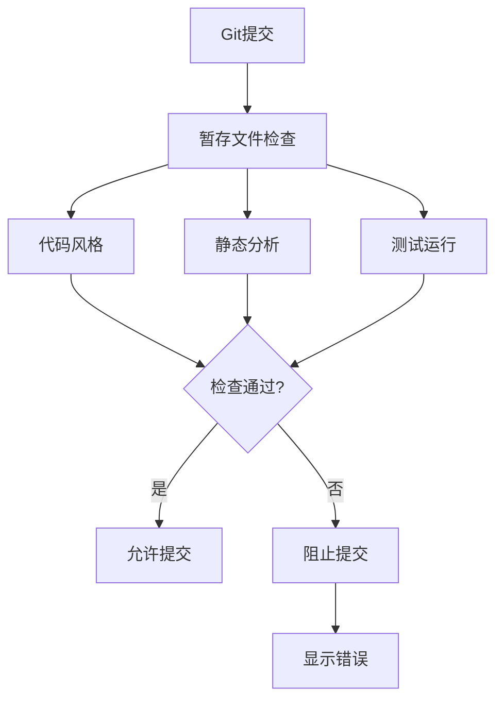

# Workflows 工作流 - Bug检查与修复

> 持续Bug检测、自动修复、预防性检查的工作流

---

## 🔍 持续Bug检查工作流

### 完整Bug检查流程



**工作流定义：**
```yaml
workflow:
  name: "ContinuousBugCheck"
  description: "持续Bug检查流程"
  type: "dag"
  
  steps:
    - id: "static_analysis"
      name: "静态分析"
      skill: "StaticAnalyzer"
      parallel:
        - skill: "PatternMatcher"
          output: "pattern_issues"
        - skill: "CodeSmellDetector"
          output: "smells"
        - skill: "ComplexityAnalyzer"
          output: "complexity"
        - skill: "DuplicateDetector"
          output: "duplicates"
      output: "static_issues"
    
    - id: "security_scan"
      name: "安全扫描"
      skill: "VulnerabilityScanner"
      parallel:
        - skill: "SecretDetector"
          output: "secrets"
        - skill: "InjectionDetector"
          output: "injections"
      output: "security_issues"
    
    - id: "test_execution"
      name: "测试执行"
      skill: "TestRunner"
      parallel:
        - skill: "UnitTestRunner"
          output: "unit_results"
        - skill: "IntegrationTestRunner"
          output: "integration_results"
      output: "test_results"
    
    - id: "coverage_check"
      name: "覆盖率检查"
      skill: "CoverageAnalyzer"
      output: "coverage_report"
    
    - id: "report_generation"
      name: "生成报告"
      skill: "BugReportGenerator"
      inputs:
        - "{{static_issues}}"
        - "{{security_issues}}"
        - "{{test_results}}"
        - "{{coverage_report}}"
      output: "bug_report"
    
    - id: "quality_gate"
      name: "质量门禁"
      skill: "QualityGate"
      input: "{{bug_report}}"
      conditions:
        - "security_issues.critical == 0"
        - "test_results.failed == 0"
        - "coverage_report.percentage > 80"
      on_fail: "block_build"
```

### 实时监控流程



**工作流定义：**
```yaml
workflow:
  name: "RealTimeBugMonitor"
  description: "实时Bug监控与修复"
  
  steps:
    - name: "错误收集"
      skill: "ErrorMonitor"
      output: "errors"
    
    - name: "错误分类"
      skill: "ErrorClassifier"
      input: "{{errors}}"
      output: "classified_errors"
    
    - name: "优先级排序"
      skill: "PrioritySorter"
      input: "{{classified_errors}}"
      output: "prioritized_errors"
    
    - name: "自动修复"
      skill: "AutoFixer"
      input: "{{prioritized_errors}}"
      output: "fix_attempts"
    
    - name: "验证修复"
      skill: "FixValidator"
      input: "{{fix_attempts}}"
      output: "validated_fixes"
    
    - condition:
        if: "{{validated_fixes.success}}"
        then:
          - skill: "AutoDeployer"
            input: "{{validated_fixes}}"
        else:
          - skill: "AlertManager"
            action: "notify_human"
```

---

## 🔄 自动修复工作流

### 智能修复循环



**工作流定义：**
```yaml
workflow:
  name: "IntelligentAutoFix"
  description: "智能自动修复流程"
  type: "loop"
  max_iterations: 5
  
  steps:
    - id: "root_cause_analysis"
      name: "根因分析"
      skill: "RootCauseAnalyzer"
      input: "{{bug}}"
      output: "root_cause"
    
    - id: "fix_generation"
      name: "生成修复"
      skill: "BugFixGenerator"
      inputs:
        - "{{bug}}"
        - "{{root_cause}}"
      output: "proposed_fix"
    
    - id: "apply_fix"
      name: "应用修复"
      skill: "PatchApplier"
      input: "{{proposed_fix}}"
      output: "patched_code"
    
    - id: "test_validation"
      name: "测试验证"
      skill: "TestRunner"
      input: "{{patched_code}}"
      output: "test_results"
    
    - id: "style_fix"
      name: "风格修复"
      skill: "StyleFixer"
      input: "{{patched_code}}"
      output: "formatted_code"
    
    - condition:
        if: "{{test_results.passed}}"
        then:
          - id: "regression_test"
            name: "回归测试"
            skill: "RegressionTester"
            output: "regression_results"
          - condition:
              if: "{{regression_results.passed}}"
              then:
                - id: "commit_fix"
                  name: "提交修复"
                  skill: "AutoCommitter"
                  output: "commit_hash"
              else:
                - action: "retry"
                  adjust_params: true
        else:
          - action: "retry"
            adjust_params: true
```

### 批量修复流程

```yaml
workflow:
  name: "BatchAutoFix"
  description: "批量自动修复"
  
  steps:
    - name: "收集问题"
      skill: "IssueCollector"
      output: "all_issues"
    
    - name: "分组排序"
      skill: "IssueGrouper"
      input: "{{all_issues}}"
      output: "grouped_issues"
    
    - loop:
        name: "批量修复"
        for: "group in grouped_issues"
        steps:
          - skill: "AutoFixer"
            input: "{{group}}"
            output: "fixes"
          
          - skill: "TestRunner"
            input: "{{fixes}}"
            output: "results"
        
        condition: "{{results.passed}}"
    
    - name: "生成PR"
      skill: "PRGenerator"
      input: "{{all_fixes}}"
      output: "pull_request"
```

---

## 🛡️ 预防性检查工作流

### 预提交检查



**工作流定义：**
```yaml
workflow:
  name: "PreCommitCheck"
  description: "预提交检查流程"
  
  steps:
    - name: "获取暂存文件"
      skill: "StagedFileCollector"
      output: "staged_files"
    
    - parallel:
        - name: "代码风格检查"
          skill: "StyleChecker"
          input: "{{staged_files}}"
          output: "style_issues"
        
        - name: "静态分析"
          skill: "StaticAnalyzer"
          input: "{{staged_files}}"
          output: "static_issues"
        
        - name: "安全扫描"
          skill: "SecurityScanner"
          input: "{{staged_files}}"
          output: "security_issues"
        
        - name: "运行测试"
          skill: "TestRunner"
          input: "{{staged_files}}"
          output: "test_results"
    
    - name: "汇总检查"
      skill: "CheckAggregator"
      inputs:
        - "{{style_issues}}"
        - "{{static_issues}}"
        - "{{security_issues}}"
        - "{{test_results}}"
      output: "check_summary"
    
    - condition:
        if: "{{check_summary.has_errors}}"
        then:
          - skill: "CommitBlocker"
            action: "block"
            message: "{{check_summary.errors}}"
        else:
          - skill: "CommitAllower"
            action: "allow"
```

### 代码审查自动化

```yaml
workflow:
  name: "AutomatedCodeReview"
  description: "自动化代码审查"
  
  trigger: "pull_request"
  
  steps:
    - name: "获取PR代码"
      skill: "PRCodeFetcher"
      output: "pr_code"
    
    - parallel:
        - name: "代码审查"
          skill: "CodeReviewer"
          input: "{{pr_code}}"
          output: "review_comments"
        
        - name: "安全审查"
          skill: "SecurityReviewer"
          input: "{{pr_code}}"
          output: "security_comments"
        
        - name: "架构审查"
          skill: "ArchitectureReviewer"
          input: "{{pr_code}}"
          output: "architecture_comments"
        
        - name: "测试覆盖"
          skill: "CoverageAnalyzer"
          input: "{{pr_code}}"
          output: "coverage_report"
    
    - name: "生成审查报告"
      skill: "ReviewReportGenerator"
      inputs:
        - "{{review_comments}}"
        - "{{security_comments}}"
        - "{{architecture_comments}}"
        - "{{coverage_report}}"
      output: "review_report"
    
    - name: "发布审查意见"
      skill: "ReviewPublisher"
      input: "{{review_report}}"
      output: "published_review"
    
    - condition:
        if: "{{review_report.has_critical_issues}}"
        then:
          - skill: "PRBlocker"
            action: "request_changes"
        else:
          - skill: "PRApprover"
            action: "approve"
```

---

## 🎯 综合工作流

### 零Bug发布流程

```yaml
workflow:
  name: "ZeroBugRelease"
  description: "零Bug发布流程"
  
  steps:
    - name: "全面检查"
      skill: "ComprehensiveChecker"
      output: "check_results"
    
    - name: "自动修复"
      skill: "AutoFixer"
      input: "{{check_results.issues}}"
      output: "fixes"
    
    - name: "验证修复"
      skill: "FixValidator"
      input: "{{fixes}}"
      output: "validation"
    
    - name: "回归测试"
      skill: "RegressionTester"
      output: "regression"
    
    - name: "性能测试"
      skill: "PerformanceTester"
      output: "performance"
    
    - name: "安全审计"
      skill: "SecurityAuditor"
      output: "security"
    
    - condition:
        all_passed:
          - "{{validation.passed}}"
          - "{{regression.passed}}"
          - "{{performance.acceptable}}"
          - "{{security.clean}}"
        then:
          - skill: "ReleaseApprover"
            action: "approve"
        else:
          - skill: "ReleaseBlocker"
            action: "block"
```

### 智能Bug预防

```yaml
workflow:
  name: "IntelligentBugPrevention"
  description: "智能Bug预防"
  
  steps:
    - name: "模式学习"
      skill: "BugPatternLearner"
      output: "bug_patterns"
    
    - name: "风险预测"
      skill: "RiskPredictor"
      input: "{{bug_patterns}}"
      output: "risk_areas"
    
    - name: "预防测试"
      skill: "PreventiveTestGenerator"
      input: "{{risk_areas}}"
      output: "preventive_tests"
    
    - name: "监控部署"
      skill: "PreventiveMonitor"
      input: "{{risk_areas}}"
      output: "monitoring_setup"
    
    - name: "持续学习"
      skill: "ContinuousLearner"
      loop: true
      output: "updated_patterns"
```

---

## 📋 模板

### 快速Bug检查

```yaml
template:
  name: "QuickBugCheck"
  description: "快速Bug检查"
  
  parameters:
    - name: "code_path"
      type: "string"
      required: true
  
  workflow:
    - skill: "StaticAnalyzer"
      input: "{{code_path}}"
    
    - skill: "SecurityScanner"
      input: "{{code_path}}"
    
    - skill: "TestRunner"
      input: "{{code_path}}"
```

### 自动修复模板

```yaml
template:
  name: "AutoFixTemplate"
  description: "自动修复模板"
  
  parameters:
    - name: "bug_description"
      type: "string"
      required: true
  
  workflow:
    - skill: "BugFixGenerator"
      input: "{{bug_description}}"
    
    - skill: "TestRunner"
    
    - skill: "AutoCommitter"
      condition: "tests_passed"
```

---

*持续更新中...*
