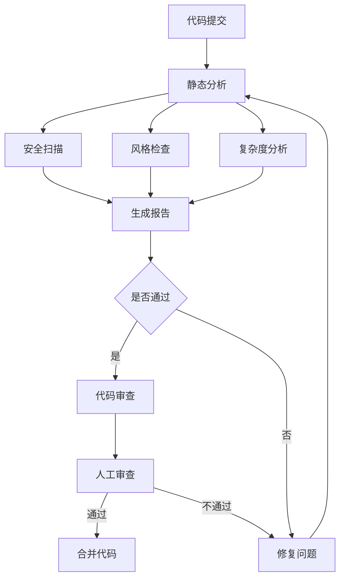
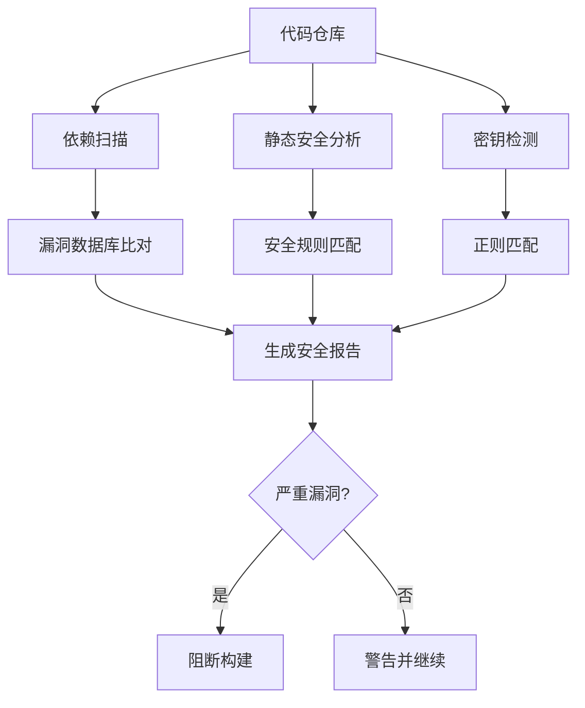
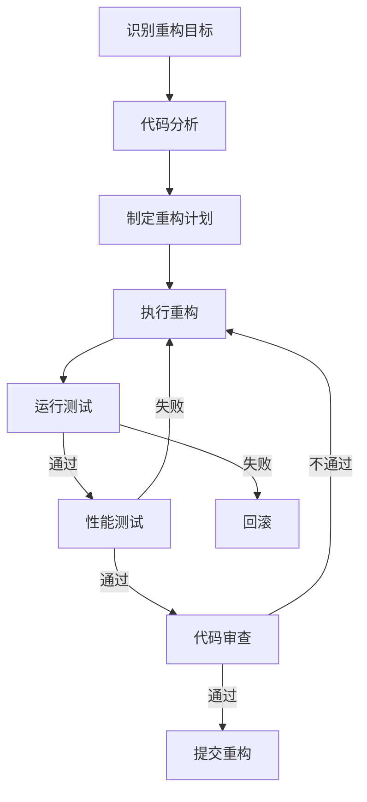
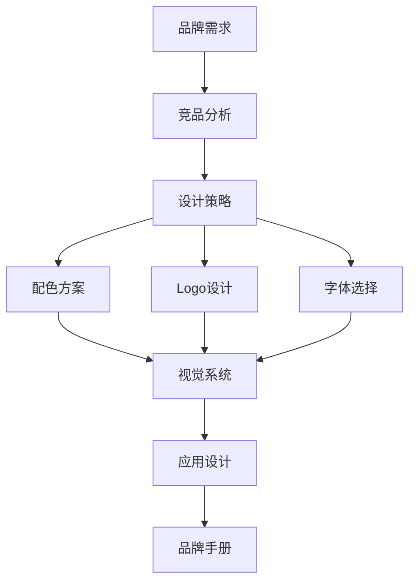
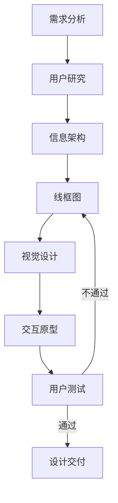
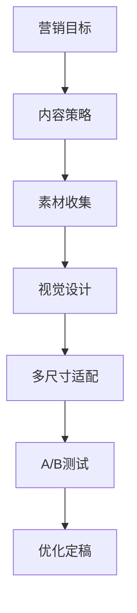
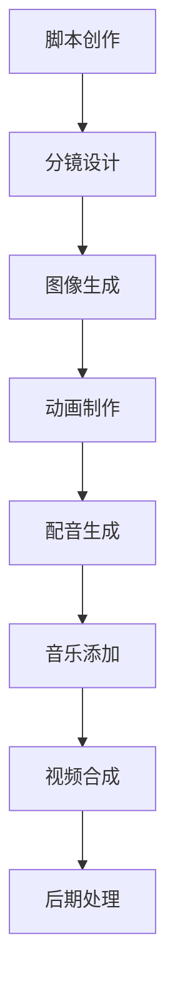

# Workflows 工作流 - 代码分析与美术设计

> 代码质量检查、语义分析、美术设计创作的工作流

---

## 🔍 代码分析工作流

### 完整代码审查流程



**工作流定义：**
```yaml
workflow:
  name: "ComprehensiveCodeReview"
  description: "完整代码审查流程"
  type: "dag"
  
  steps:
    - id: "static_analysis"
      name: "静态代码分析"
      skill: "StaticAnalyzer"
      parallel:
        - skill: "SecurityScanner"
          output: "security_issues"
        - skill: "StyleChecker"
          output: "style_issues"
        - skill: "ComplexityChecker"
          output: "complexity_report"
      output: "analysis_results"
    
    - id: "duplicate_check"
      name: "重复代码检测"
      skill: "DuplicateDetector"
      input: "{{code_repository}}"
      output: "duplicates"
    
    - id: "dependency_analysis"
      name: "依赖分析"
      skill: "DependencyAnalyzer"
      output: "dependency_graph"
    
    - id: "report_generation"
      name: "生成审查报告"
      skill: "ReportGenerator"
      input:
        - "{{analysis_results}}"
        - "{{duplicates}}"
        - "{{dependency_graph}}"
      output: "review_report"
    
    - id: "quality_gate"
      name: "质量门禁"
      skill: "QualityGate"
      input: "{{review_report}}"
      conditions:
        - "security_issues.critical == 0"
        - "complexity_report.max < 20"
        - "duplicates.percentage < 5"
      on_pass: "human_review"
      on_fail: "fix_issues"
    
    - id: "fix_issues"
      name: "修复问题"
      skill: "CodeFixer"
      input: "{{review_report}}"
      output: "fixed_code"
      next: "static_analysis"
    
    - id: "human_review"
      name: "人工审查"
      skill: "HumanReviewer"
      input: "{{review_report}}"
      output: "approval_status"
    
    - id: "merge_code"
      name: "合并代码"
      skill: "CodeMerger"
      condition: "{{approval_status}} == 'approved'"
```

### 安全审计流程



**工作流定义：**
```yaml
workflow:
  name: "SecurityAudit"
  description: "安全审计流程"
  
  steps:
    - parallel:
        - name: "依赖漏洞扫描"
          skill: "DependencyVulnerabilityScanner"
          tool: "snyk-mcp"
          output: "vuln_deps"
        
        - name: "静态安全分析"
          skill: "StaticSecurityAnalyzer"
          tool: "semgrep-mcp"
          output: "security_issues"
        
        - name: "密钥泄露检测"
          skill: "SecretDetector"
          tool: "trufflehog-mcp"
          output: "exposed_secrets"
        
        - name: "代码注入检测"
          skill: "InjectionDetector"
          output: "injection_risks"
    
    - name: "聚合安全报告"
      skill: "SecurityReportAggregator"
      inputs:
        - "{{vuln_deps}}"
        - "{{security_issues}}"
        - "{{exposed_secrets}}"
        - "{{injection_risks}}"
      output: "security_report"
    
    - name: "风险评估"
      skill: "RiskEvaluator"
      input: "{{security_report}}"
      output: "risk_assessment"
    
    - condition:
        if: "{{risk_assessment.critical_count}} > 0"
        then:
          - skill: "BuildBlocker"
            action: "block"
        else:
          - skill: "BuildBlocker"
            action: "warn"
```

### 代码重构流程



---

## 🎨 美术设计工作流

### 品牌视觉设计流程



**工作流定义：**
```yaml
workflow:
  name: "BrandVisualDesign"
  description: "品牌视觉系统设计"
  type: "dag"
  
  steps:
    - id: "competitor_analysis"
      name: "竞品视觉分析"
      skill: "CompetitorAnalyzer"
      input: "{{brand_industry}}"
      output: "competitor_visuals"
    
    - id: "design_strategy"
      name: "设计策略制定"
      skill: "DesignStrategist"
      inputs:
        - "{{brand_requirements}}"
        - "{{competitor_visuals}}"
      output: "design_strategy"
    
    - parallel:
        - id: "color_palette"
          name: "配色方案"
          skill: "ColorPaletteGenerator"
          input: "{{design_strategy}}"
          output: "color_system"
        
        - id: "logo_design"
          name: "Logo设计"
          skill: "LogoDesigner"
          input: "{{design_strategy}}"
          iterations: 3
          output: "logo_options"
        
        - id: "typography"
          name: "字体系统"
          skill: "FontRecommender"
          input: "{{design_strategy}}"
          output: "font_system"
    
    - id: "visual_system"
      name: "视觉系统整合"
      skill: "VisualSystemDesigner"
      inputs:
        - "{{color_system}}"
        - "{{logo_options.selected}}"
        - "{{font_system}}"
      output: "visual_identity"
    
    - id: "applications"
      name: "应用设计"
      skill: "BrandApplicationDesigner"
      input: "{{visual_identity}}"
      applications:
        - "business_card"
        - "letterhead"
        - "social_media"
        - "website"
      output: "brand_applications"
    
    - id: "brand_guidelines"
      name: "品牌手册"
      skill: "BrandGuidelineGenerator"
      inputs:
        - "{{visual_identity}}"
        - "{{brand_applications}}"
      output: "brand_guidelines_pdf"
```

### UI/UX设计流程



**工作流定义：**
```yaml
workflow:
  name: "UIUXDesignProcess"
  description: "完整UI/UX设计流程"
  
  steps:
    - name: "需求理解"
      skill: "RequirementsAnalyzer"
      output: "design_requirements"
    
    - name: "用户画像"
      skill: "UserPersonaCreator"
      input: "{{design_requirements.target_users}}"
      output: "user_personas"
    
    - name: "竞品UI分析"
      skill: "UICompetitorAnalyzer"
      output: "ui_benchmarks"
    
    - name: "信息架构"
      skill: "InformationArchitect"
      inputs:
        - "{{design_requirements.features}}"
        - "{{user_personas}}"
      output: "information_architecture"
    
    - name: "用户流程"
      skill: "UserFlowDesigner"
      input: "{{information_architecture}}"
      output: "user_flows"
    
    - name: "线框图设计"
      skill: "WireframeDesigner"
      input: "{{user_flows}}"
      output: "wireframes"
    
    - name: "视觉设计系统"
      skill: "DesignSystemCreator"
      inputs:
        - "{{design_requirements.brand_guidelines}}"
        - "{{ui_benchmarks}}"
      output: "design_system"
    
    - name: "高保真设计"
      skill: "UIDesigner"
      inputs:
        - "{{wireframes}}"
        - "{{design_system}}"
      output: "ui_designs"
    
    - name: "交互原型"
      skill: "PrototypeCreator"
      input: "{{ui_designs}}"
      output: "interactive_prototype"
    
    - name: "可用性测试"
      skill: "UsabilityTester"
      input: "{{interactive_prototype}}"
      output: "test_results"
    
    - condition:
        if: "{{test_results.score}} >= 80"
        then:
          - name: "设计交付"
            skill: "DesignDeliverableGenerator"
            output: "design_specs"
        else:
          - name: "迭代优化"
            skill: "DesignOptimizer"
            input: "{{test_results.feedback}}"
            next: "wireframes"
```

### 营销物料设计流程



**工作流定义：**
```yaml
workflow:
  name: "MarketingMaterialDesign"
  description: "营销物料设计流程"
  
  steps:
    - name: "营销分析"
      skill: "MarketingAnalyzer"
      input: "{{campaign_goals}}"
      output: "design_brief"
    
    - name: "素材生成"
      skill: "ImageGenerator"
      input: "{{design_brief.visual_concept}}"
      count: 5
      output: "generated_images"
    
    - name: "素材搜索"
      skill: "StockImageSearcher"
      input: "{{design_brief.keywords}}"
      output: "stock_images"
    
    - name: "配色方案"
      skill: "ColorPaletteGenerator"
      input: "{{design_brief.mood}}"
      output: "color_palette"
    
    - parallel:
        - name: "Banner设计"
          skill: "BannerCreator"
          sizes:
            - "1200x628"
            - "1080x1080"
            - "1920x1080"
          output: "banners"
        
        - name: "海报设计"
          skill: "PosterDesigner"
          output: "posters"
        
        - name: "社交媒体图"
          skill: "SocialMediaImageCreator"
          platforms:
            - "instagram"
            - "facebook"
            - "twitter"
          output: "social_images"
    
    - name: "A/B测试准备"
      skill: "ABTestDesigner"
      inputs:
        - "{{banners}}"
        - "{{posters}}"
      output: "test_variants"
    
    - name: "设计规范"
      skill: "DesignSpecGenerator"
      output: "design_specifications"
```

---

## 🎬 多媒体创作工作流

### AI视频制作流程



**工作流定义：**
```yaml
workflow:
  name: "AIVideoProduction"
  description: "AI视频制作流程"
  
  steps:
    - name: "脚本创作"
      skill: "ScriptWriter"
      input: "{{video_topic}}"
      output: "video_script"
    
    - name: "分镜设计"
      skill: "StoryboardDesigner"
      input: "{{video_script}}"
      output: "storyboard"
    
    - name: "视觉生成"
      skill: "ImageGenerator"
      input: "{{storyboard.scenes}}"
      style: "cinematic"
      output: "scene_images"
    
    - name: "视频生成"
      skill: "VideoGenerator"
      input: "{{scene_images}}"
      motion: "camera_movement"
      output: "video_clips"
    
    - name: "配音生成"
      skill: "VoiceGenerator"
      input: "{{video_script.dialogue}}"
      voice: "professional"
      output: "voiceover"
    
    - name: "背景音乐"
      skill: "MusicGenerator"
      input: "{{video_script.mood}}"
      output: "background_music"
    
    - name: "视频合成"
      skill: "VideoComposer"
      inputs:
        - "{{video_clips}}"
        - "{{voiceover}}"
        - "{{background_music}}"
      output: "rough_cut"
    
    - name: "后期处理"
      skill: "VideoPostProcessor"
      input: "{{rough_cut}}"
      effects:
        - "color_grading"
        - "transitions"
        - "subtitles"
      output: "final_video"
```

---

## 🔄 综合工作流

### 代码+设计文档生成

```yaml
workflow:
  name: "CodeDocumentationWithDesign"
  description: "生成带设计图的代码文档"
  
  steps:
    - name: "代码分析"
      skill: "CodeAnalyzer"
      output: "code_structure"
    
    - name: "架构图生成"
      skill: "ArchitectureDiagramGenerator"
      input: "{{code_structure}}"
      output: "architecture_diagram"
    
    - name: "流程图生成"
      skill: "FlowchartGenerator"
      input: "{{code_structure.workflows}}"
      output: "flowcharts"
    
    - name: "文档编写"
      skill: "TechnicalWriter"
      inputs:
        - "{{code_structure}}"
        - "{{architecture_diagram}}"
        - "{{flowcharts}}"
      output: "technical_documentation"
    
    - name: "配图设计"
      skill: "DocumentationIllustrator"
      input: "{{technical_documentation}}"
      output: "documentation_images"
    
    - name: "文档整合"
      skill: "DocumentAssembler"
      inputs:
        - "{{technical_documentation}}"
        - "{{documentation_images}}"
      output: "complete_documentation"
```

### 智能代码审查+可视化

```yaml
workflow:
  name: "VisualCodeReview"
  description: "可视化代码审查报告"
  
  steps:
    - name: "代码分析"
      skill: "ComprehensiveCodeAnalyzer"
      output: "analysis_data"
    
    - name: "问题可视化"
      skill: "IssueVisualizer"
      input: "{{analysis_data.issues}}"
      output: "issue_charts"
    
    - name: "依赖图生成"
      skill: "DependencyGraphVisualizer"
      input: "{{analysis_data.dependencies}}"
      output: "dependency_graph"
    
    - name: "复杂度热力图"
      skill: "ComplexityHeatmapGenerator"
      input: "{{analysis_data.complexity}}"
      output: "complexity_heatmap"
    
    - name: "报告设计"
      skill: "ReportDesigner"
      inputs:
        - "{{analysis_data}}"
        - "{{issue_charts}}"
        - "{{dependency_graph}}"
        - "{{complexity_heatmap}}"
      output: "visual_report"
```

---

## 📋 模板

### 代码质量检查模板

```yaml
template:
  name: "CodeQualityCheck"
  description: "代码质量快速检查"
  
  parameters:
    - name: "code_path"
      type: "string"
      required: true
    
    - name: "language"
      type: "string"
      default: "auto"
    
    - name: "strict_mode"
      type: "boolean"
      default: false
  
  workflow:
    - skill: "StaticAnalyzer"
      input: "{{code_path}}"
      config:
        language: "{{language}}"
        strict: "{{strict_mode}}"
    
    - skill: "SecurityScanner"
      input: "{{code_path}}"
    
    - skill: "ComplexityChecker"
      input: "{{code_path}}"
    
    - skill: "ReportGenerator"
      format: "markdown"
```

### 快速设计模板

```yaml
template:
  name: "QuickDesign"
  description: "快速生成设计方案"
  
  parameters:
    - name: "design_type"
      type: "enum"
      options: ["logo", "banner", "ui", "icon"]
    
    - name: "description"
      type: "string"
      required: true
    
    - name: "style"
      type: "string"
      default: "modern"
  
  workflow:
    - skill: "ColorPaletteGenerator"
      input: "{{description}}"
    
    - skill: "ImageGenerator"
      input: "{{description}}"
      style: "{{style}}"
      count: 3
    
    - skill: "DesignRefiner"
      iterations: 2
```

---

*持续更新中...*
