# Workflows 工作流库

> AI Agent 工作流收集与编排
> 更新时间：2026-03-24

## 📚 目录结构

```
\python\Workflows\
├── README.md                    # 本文件
├── 📁 Development/              # 开发工作流
├── 📁 Analysis/                 # 分析工作流
├── 📁 Design/                   # 设计工作流
├── 📁 Automation/               # 自动化工作流
├── 📁 Research/                 # 研究工作流
├── 📁 Business/                 # 商业工作流
├── 📁 DevOps/                   # DevOps工作流
├── 📁 Templates/                # 工作流模板
└── 📁 Engines/                  # 工作流引擎
```

---

## 🔄 工作流类型

### 1. 顺序工作流 (Sequential)
线性执行，步骤依次进行

### 2. 并行工作流 (Parallel)
多个步骤同时执行

### 3. 条件工作流 (Conditional)
根据条件分支执行

### 4. 循环工作流 (Loop)
重复执行直到满足条件

### 5. DAG工作流 (Directed Acyclic Graph)
有向无环图，支持复杂依赖

---

## 💻 Development - 开发工作流

### 全栈开发流程

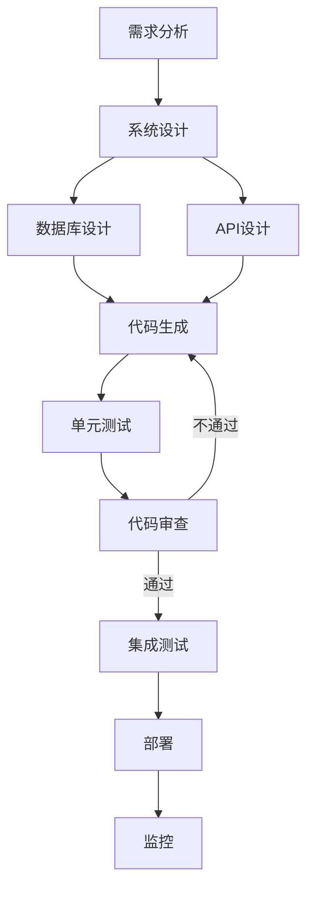

**工作流定义：**
```yaml
workflow:
  name: "FullStackDevelopment"
  description: "全栈应用开发完整流程"
  type: "dag"
  
  steps:
    - id: "requirements"
      name: "需求分析"
      skill: "RequirementsAnalyzer"
      next: ["system_design"]
    
    - id: "system_design"
      name: "系统设计"
      skill: "SystemArchitect"
      next: ["db_design", "api_design"]
    
    - id: "db_design"
      name: "数据库设计"
      skill: "DatabaseDesigner"
      next: ["code_generation"]
    
    - id: "api_design"
      name: "API设计"
      skill: "APIDesigner"
      next: ["code_generation"]
    
    - id: "code_generation"
      name: "代码生成"
      skill: "CodeGenerator"
      next: ["unit_test"]
    
    - id: "unit_test"
      name: "单元测试"
      skill: "TestGenerator"
      next: ["code_review"]
    
    - id: "code_review"
      name: "代码审查"
      skill: "CodeReviewer"
      next: ["integration_test"]
      on_fail: "code_generation"
    
    - id: "integration_test"
      name: "集成测试"
      skill: "IntegrationTester"
      next: ["deploy"]
    
    - id: "deploy"
      name: "部署"
      skill: "Deployer"
      next: ["monitor"]
    
    - id: "monitor"
      name: "监控"
      skill: "SystemMonitor"
```

### 代码重构流程

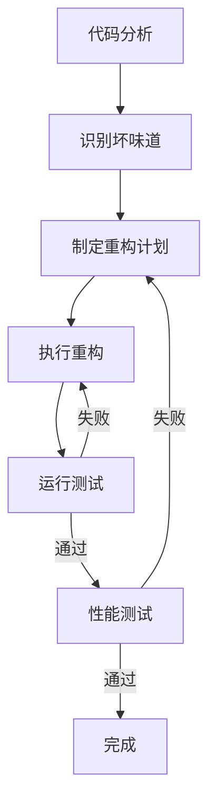

### Bug修复流程

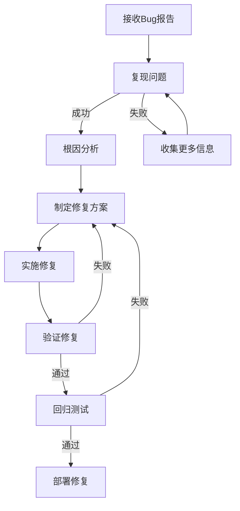

---

## 📊 Analysis - 分析工作流

### 数据分析流程

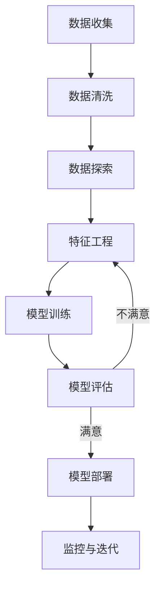

**工作流定义：**
```yaml
workflow:
  name: "DataAnalysisPipeline"
  description: "完整数据分析流程"
  type: "dag"
  
  steps:
    - id: "data_collection"
      name: "数据收集"
      skill: "DataCollector"
      next: ["data_cleaning"]
    
    - id: "data_cleaning"
      name: "数据清洗"
      skill: "DataCleaner"
      next: ["data_exploration"]
    
    - id: "data_exploration"
      name: "数据探索"
      skill: "DataExplorer"
      next: ["feature_engineering"]
    
    - id: "feature_engineering"
      name: "特征工程"
      skill: "FeatureEngineer"
      next: ["model_training"]
    
    - id: "model_training"
      name: "模型训练"
      skill: "MLModelTrainer"
      next: ["model_evaluation"]
    
    - id: "model_evaluation"
      name: "模型评估"
      skill: "ModelEvaluator"
      next: ["model_deployment"]
      on_fail: "feature_engineering"
    
    - id: "model_deployment"
      name: "模型部署"
      skill: "ModelDeployer"
      next: ["monitoring"]
    
    - id: "monitoring"
      name: "监控迭代"
      skill: "ModelMonitor"
```

### 竞品分析流程

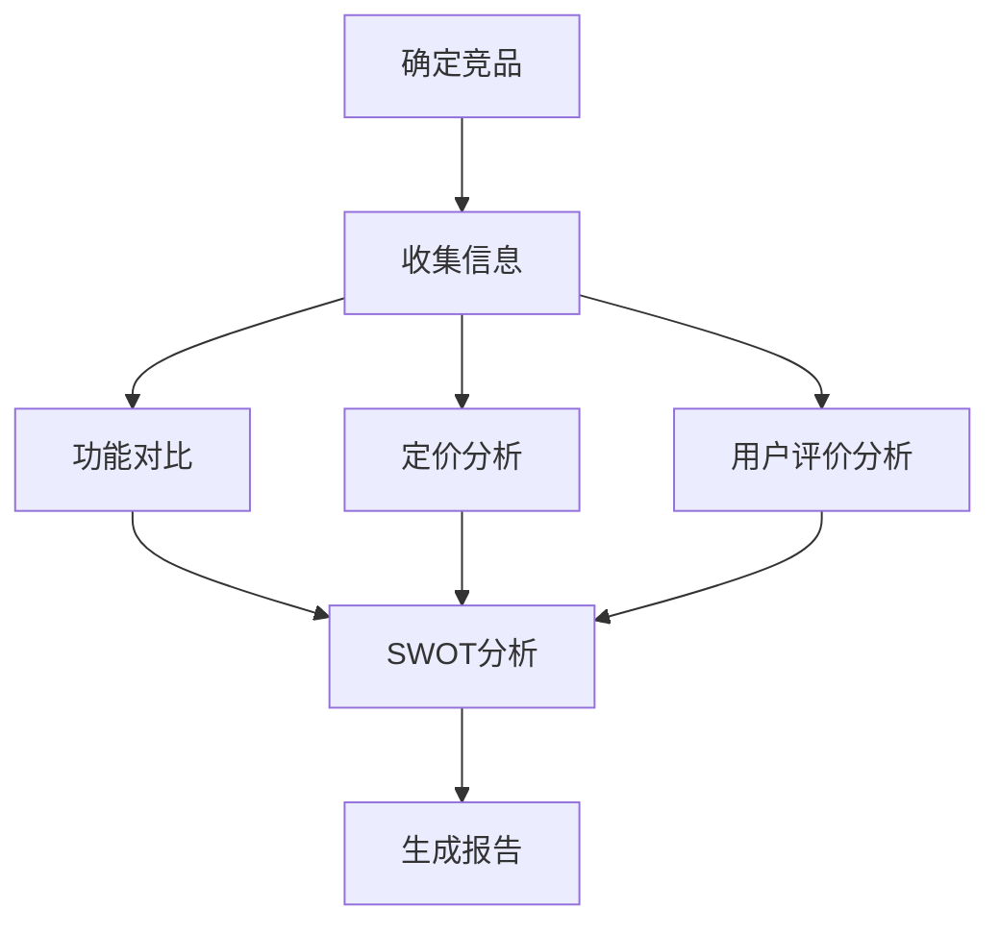

---

## 🎨 Design - 设计工作流

### UI/UX设计流程

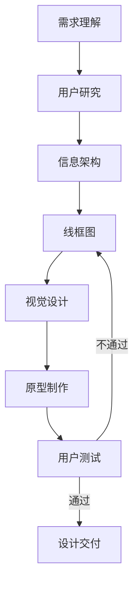

### 系统设计流程

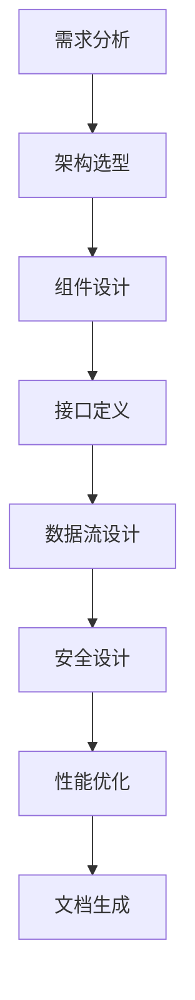

---

## 🤖 Automation - 自动化工作流

### CI/CD流程

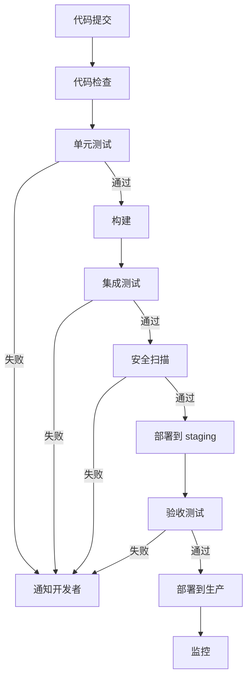

### 文档自动生成流程

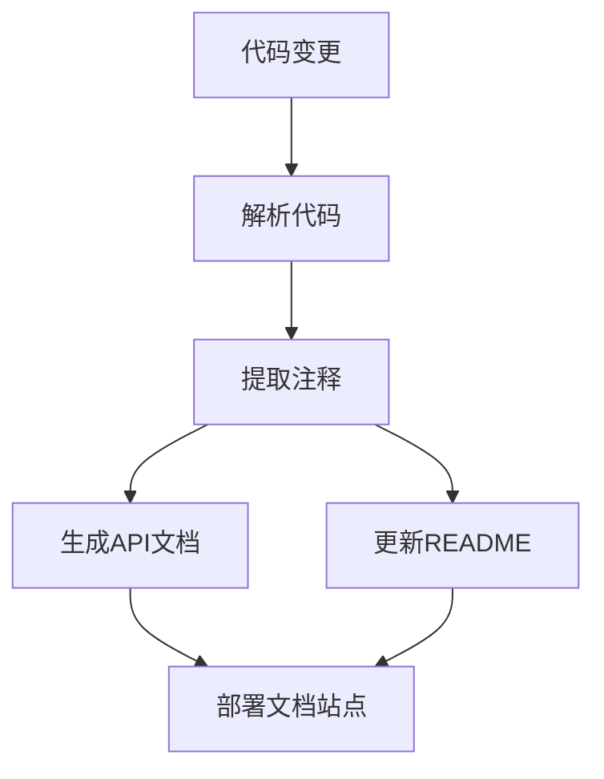

---

## 🔬 Research - 研究工作流

### 文献综述流程

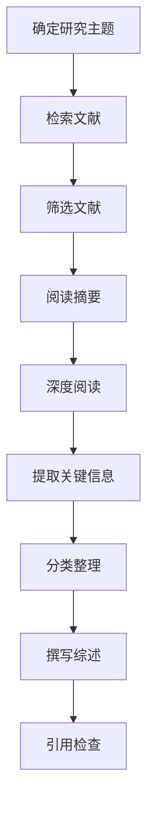

### 技术调研流程

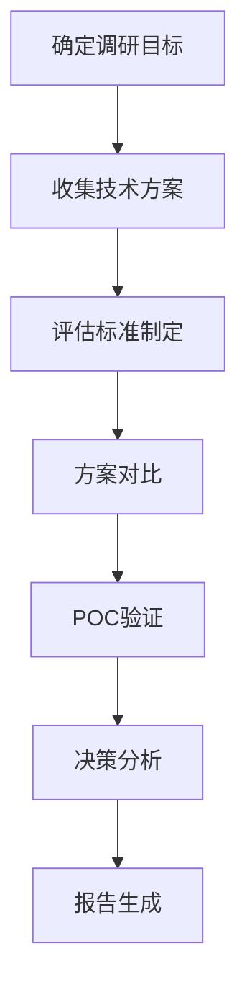

---

## 💼 Business - 商业工作流

### 产品需求文档(PRD)流程

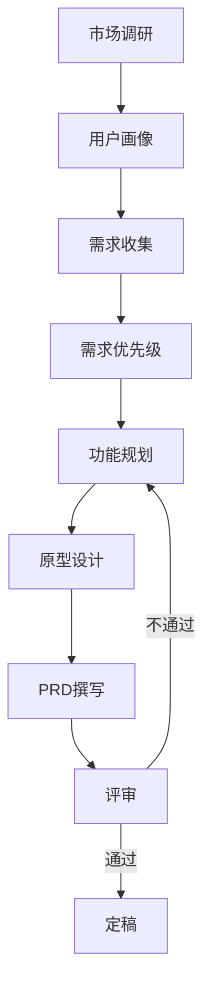

### 商业分析流程

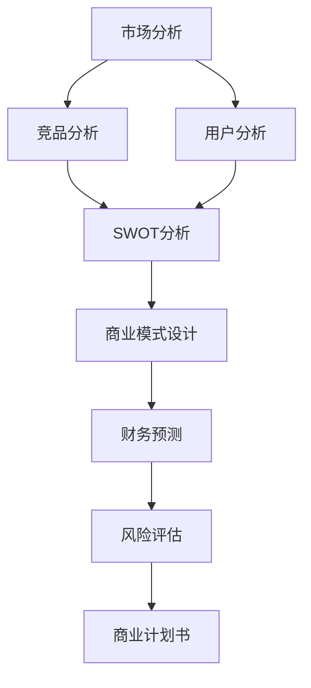

---

## 🚀 DevOps - DevOps工作流

### 基础设施即代码(IaC)流程

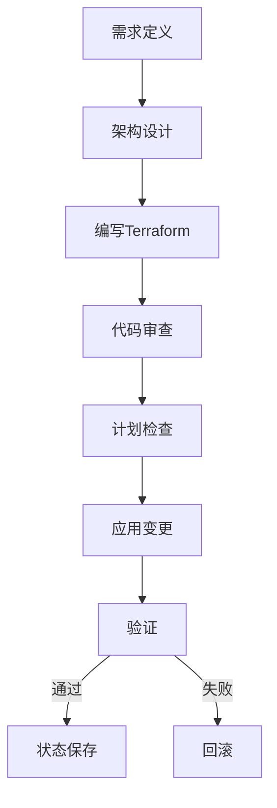

### 监控告警流程

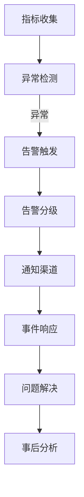

---

## 📋 Templates - 工作流模板

### 模板1：简单顺序工作流

```yaml
template:
  name: "SimpleSequential"
  description: "简单顺序执行模板"
  type: "sequential"
  
  structure:
    - step:
        name: "步骤1"
        skill: "Skill1"
        input: "{{input}}"
        output: "step1_output"
    
    - step:
        name: "步骤2"
        skill: "Skill2"
        input: "{{step1_output}}"
        output: "step2_output"
    
    - step:
        name: "步骤3"
        skill: "Skill3"
        input: "{{step2_output}}"
        output: "final_output"
```

### 模板2：条件分支工作流

```yaml
template:
  name: "ConditionalBranch"
  description: "条件分支执行模板"
  type: "conditional"
  
  structure:
    - step:
        name: "条件判断"
        skill: "ConditionChecker"
        input: "{{input}}"
        output: "condition_result"
    
    - branch:
        condition: "{{condition_result}} == 'A'"
        steps:
          - skill: "SkillA"
            output: "branch_a_output"
    
    - branch:
        condition: "{{condition_result}} == 'B'"
        steps:
          - skill: "SkillB"
            output: "branch_b_output"
    
    - merge:
        inputs: ["branch_a_output", "branch_b_output"]
        skill: "ResultMerger"
        output: "final_output"
```

### 模板3：并行工作流

```yaml
template:
  name: "ParallelExecution"
  description: "并行执行模板"
  type: "parallel"
  
  structure:
    - parallel:
        name: "并行任务组"
        tasks:
          - name: "任务A"
            skill: "SkillA"
            input: "{{input}}"
            output: "result_a"
          
          - name: "任务B"
            skill: "SkillB"
            input: "{{input}}"
            output: "result_b"
          
          - name: "任务C"
            skill: "SkillC"
            input: "{{input}}"
            output: "result_c"
    
    - step:
        name: "结果聚合"
        skill: "Aggregator"
        input: 
          - "{{result_a}}"
          - "{{result_b}}"
          - "{{result_c}}"
        output: "final_output"
```

---

## ⚙️ Engines - 工作流引擎

### 引擎架构

```
┌─────────────────────────────────────────────────────────┐
│                    Workflow Engine                       │
├─────────────────────────────────────────────────────────┤
│  Parser → Validator → Scheduler → Executor → Monitor    │
├─────────────────────────────────────────────────────────┤
│  State Store │ Event Bus │ Retry Logic │ Rollback Mgr   │
└─────────────────────────────────────────────────────────┘
```

### 核心组件

| 组件 | 功能 | 说明 |
|------|------|------|
| **Parser** | 解析工作流定义 | YAML/JSON → 内部表示 |
| **Validator** | 验证工作流 | 检查循环依赖、参数匹配 |
| **Scheduler** | 调度执行 | 确定执行顺序、并行度 |
| **Executor** | 执行步骤 | 调用技能、处理结果 |
| **Monitor** | 监控状态 | 跟踪进度、收集指标 |
| **State Store** | 状态存储 | 持久化执行状态 |
| **Event Bus** | 事件总线 | 组件间通信 |
| **Retry Logic** | 重试机制 | 失败重试策略 |
| **Rollback** | 回滚管理 | 失败时回滚操作 |

---

## 🔄 工作流编排示例

### 复杂数据处理流程

```yaml
workflow:
  name: "ComplexDataPipeline"
  description: "复杂数据处理流程，包含并行、条件、循环"
  
  steps:
    # 1. 数据收集（并行）
    - parallel:
        name: "多源数据收集"
        tasks:
          - skill: "DatabaseExtractor"
            output: "db_data"
          - skill: "APIFetcher"
            output: "api_data"
          - skill: "FileReader"
            output: "file_data"
    
    # 2. 数据清洗（顺序）
    - step:
        name: "数据清洗"
        skill: "DataCleaner"
        input: 
          - "{{db_data}}"
          - "{{api_data}}"
          - "{{file_data}}"
        output: "cleaned_data"
    
    # 3. 质量检查（条件）
    - step:
        name: "质量评估"
        skill: "QualityChecker"
        input: "{{cleaned_data}}"
        output: "quality_score"
    
    - branch:
        condition: "{{quality_score}} < 0.8"
        steps:
          - skill: "DataImprover"
            output: "improved_data"
          - skill: "QualityChecker"
            input: "{{improved_data}}"
            output: "quality_score"
    
    # 4. 数据处理（循环）
    - loop:
        name: "批量处理"
        iterator: "batch in {{cleaned_data.batches}}"
        steps:
          - skill: "DataProcessor"
            input: "{{batch}}"
            output: "processed_batch"
        aggregate: "processed_results"
    
    # 5. 结果输出
    - step:
        name: "生成报告"
        skill: "ReportGenerator"
        input: "{{processed_results}}"
        output: "final_report"
```

---

## 📚 参考资料

- [Temporal.io](https://temporal.io/) - 工作流引擎
- [Apache Airflow](https://airflow.apache.org/) - 数据管道
- [Prefect](https://www.prefect.io/) - 现代工作流编排
- [Dagster](https://dagster.io/) - 数据编排

---

*持续更新中...*
