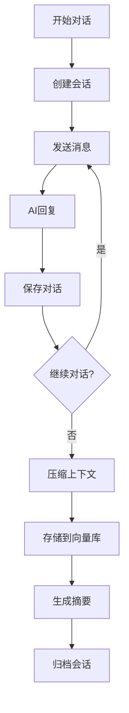
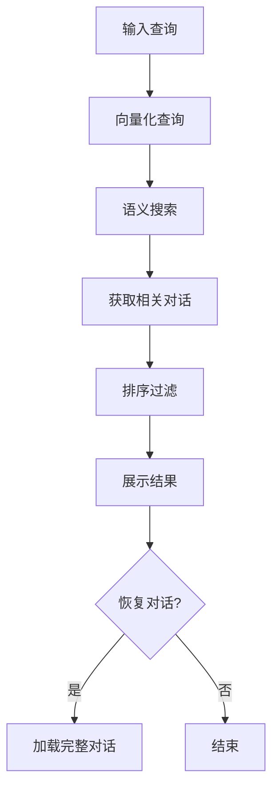
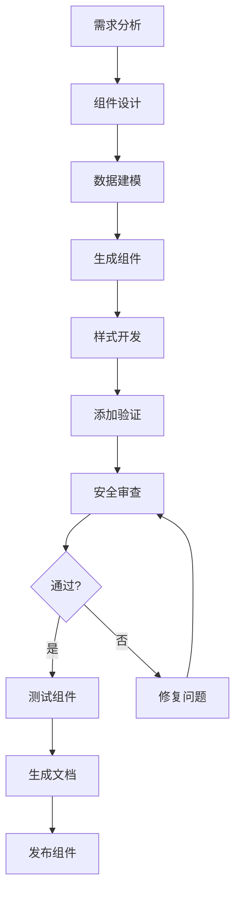
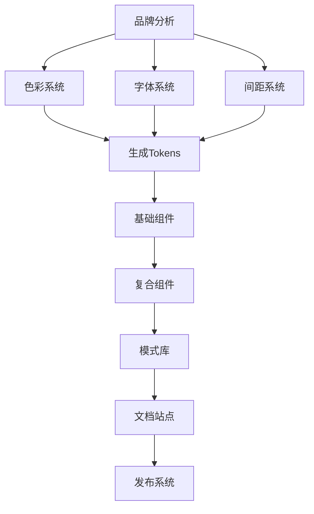
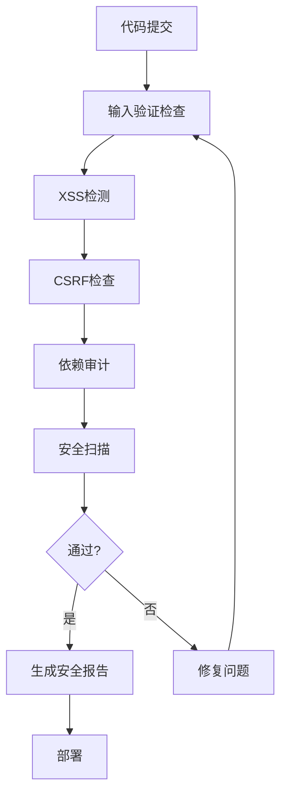
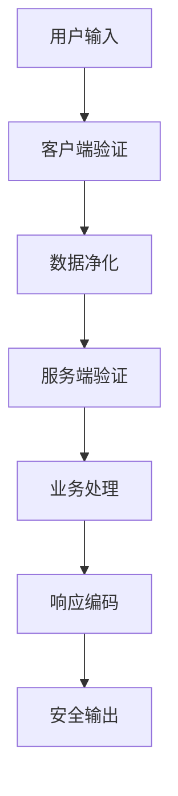

# Workflows 工作流 - 存储与前端设计

> 对话存储管理、前端 UI 开发、安全防护的工作流

---

## 💾 对话存储工作流

### 完整对话管理流程



**工作流定义：**
```yaml
workflow:
  name: "ConversationManagement"
  description: "完整的AI对话管理流程"
  type: "dag"
  
  steps:
    - id: "session_creation"
      name: "创建会话"
      skill: "SessionCreator"
      input:
        title: "{{conversation_title}}"
        model: "{{ai_model}}"
        tags: "{{tags}}"
      output: "session_id"
    
    - id: "message_loop"
      name: "消息循环"
      type: "loop"
      condition: "{{user_wants_continue}}"
      steps:
        - skill: "MessageReceiver"
          input: "{{user_input}}"
          output: "message"
        
        - skill: "ContextBuilder"
          inputs:
            - "{{session_id}}"
            - "{{recent_messages}}"
          output: "context"
        
        - skill: "AIResponder"
          input: "{{context}}"
          output: "ai_response"
        
        - skill: "ConversationSaver"
          inputs:
            session_id: "{{session_id}}"
            message: "{{message}}"
            response: "{{ai_response}}"
          output: "save_status"
      
      on_exit: "conversation_end"
    
    - id: "conversation_end"
      name: "对话结束处理"
      parallel:
        - skill: "ContextCompressor"
          input: "{{full_conversation}}"
          output: "compressed_context"
        
        - skill: "ConversationSummarizer"
          input: "{{full_conversation}}"
          output: "summary"
        
        - skill: "KnowledgeExtractor"
          input: "{{full_conversation}}"
          output: "key_knowledge"
    
    - id: "vector_storage"
      name: "向量存储"
      skill: "KnowledgeIngestor"
      inputs:
        - "{{compressed_context}}"
        - "{{summary}}"
        - "{{key_knowledge}}"
      output: "vector_ids"
    
    - id: "session_archival"
      name: "会话归档"
      skill: "ConversationArchiver"
      inputs:
        session_id: "{{session_id}}"
        summary: "{{summary}}"
        vector_ids: "{{vector_ids}}"
      output: "archive_path"
```

### 对话检索流程



**工作流定义：**
```yaml
workflow:
  name: "ConversationRetrieval"
  description: "检索历史对话"
  
  steps:
    - name: "查询处理"
      skill: "QueryProcessor"
      input: "{{user_query}}"
      output: "processed_query"
    
    - name: "向量化"
      skill: "TextEmbedder"
      input: "{{processed_query}}"
      output: "query_vector"
    
    - name: "语义搜索"
      skill: "KnowledgeRetriever"
      input: "{{query_vector}}"
      config:
        top_k: 10
        threshold: 0.7
      output: "similar_conversations"
    
    - name: "结果排序"
      skill: "ResultRanker"
      input: "{{similar_conversations}}"
      criteria:
        - relevance
        - recency
        - importance
      output: "ranked_results"
    
    - name: "结果展示"
      skill: "ResultPresenter"
      input: "{{ranked_results}}"
      format: "summary_list"
      output: "displayed_results"
    
    - condition:
        if: "{{user_selects_conversation}}"
        then:
          - name: "加载对话"
            skill: "ConversationLoader"
            input: "{{selected_conversation_id}}"
            output: "full_conversation"
          
          - name: "恢复上下文"
            skill: "ContextRestorer"
            input: "{{full_conversation}}"
            output: "restored_context"
```

---

## 🎨 前端开发工作流

### 完整页面开发流程



**工作流定义：**
```yaml
workflow:
  name: "CompletePageDevelopment"
  description: "完整的前端页面开发流程"
  type: "dag"
  
  steps:
    - id: "requirement_analysis"
      name: "需求分析"
      skill: "RequirementsAnalyzer"
      input: "{{page_requirements}}"
      output: "analysis_result"
    
    - id: "component_design"
      name: "组件设计"
      skill: "ComponentDesigner"
      input: "{{analysis_result}}"
      output: "component_specs"
    
    - id: "data_modeling"
      name: "数据建模"
      skill: "DataModeler"
      input: "{{component_specs.data_requirements}}"
      output: "data_models"
    
    - id: "schema_generation"
      name: "验证Schema生成"
      skill: "SchemaGenerator"
      input: "{{data_models}}"
      output: "validation_schemas"
    
    - parallel:
        - id: "component_generation"
          name: "组件代码生成"
          skill: "ComponentGenerator"
          inputs:
            specs: "{{component_specs}}"
            framework: "{{target_framework}}"
            ui_library: "{{ui_library}}"
          output: "component_code"
        
        - id: "style_generation"
          name: "样式生成"
          skill: "StyleGenerator"
          inputs:
            design: "{{component_specs.design}}"
            framework: "{{target_framework}}"
          output: "styles"
    
    - id: "security_integration"
      name: "安全集成"
      skill: "SecurityIntegrator"
      inputs:
        component: "{{component_code}}"
        schemas: "{{validation_schemas}}"
      output: "secured_component"
    
    - id: "security_review"
      name: "安全审查"
      skill: "SecurityAuditor"
      input: "{{secured_component}}"
      output: "security_report"
    
    - id: "quality_gate"
      name: "质量门禁"
      skill: "QualityGate"
      input: "{{security_report}}"
      conditions:
        - "security_report.critical_issues == 0"
        - "security_report.xss_vulnerabilities == 0"
      on_pass: "testing"
      on_fail: "security_fix"
    
    - id: "security_fix"
      name: "安全修复"
      skill: "SecurityFixer"
      input: "{{security_report}}"
      output: "fixed_component"
      next: "security_review"
    
    - id: "testing"
      name: "组件测试"
      skill: "ComponentTester"
      input: "{{secured_component}}"
      output: "test_results"
    
    - id: "documentation"
      name: "文档生成"
      skill: "ComponentDocumenter"
      inputs:
        component: "{{secured_component}}"
        tests: "{{test_results}}"
      output: "documentation"
    
    - id: "publication"
      name: "发布"
      skill: "ComponentPublisher"
      inputs:
        component: "{{secured_component}}"
        docs: "{{documentation}}"
      output: "published_component"
```

### 设计系统构建流程



**工作流定义：**
```yaml
workflow:
  name: "DesignSystemBuilder"
  description: "构建完整的设计系统"
  
  steps:
    - name: "品牌分析"
      skill: "BrandAnalyzer"
      input: "{{brand_guidelines}}"
      output: "brand_insights"
    
    - parallel:
        - name: "色彩系统"
          skill: "ColorSystemCreator"
          input: "{{brand_insights.colors}}"
          output: "color_system"
        
        - name: "字体系统"
          skill: "TypographySystemCreator"
          input: "{{brand_insights.typography}}"
          output: "typography_system"
        
        - name: "间距系统"
          skill: "SpacingSystemCreator"
          input: "{{brand_insights.spacing}}"
          output: "spacing_system"
    
    - name: "生成设计Tokens"
      skill: "TokenGenerator"
      inputs:
        - "{{color_system}}"
        - "{{typography_system}}"
        - "{{spacing_system}}"
      output: "design_tokens"
    
    - name: "基础组件"
      skill: "PrimitiveComponentBuilder"
      input: "{{design_tokens}}"
      components:
        - Button
        - Input
        - Card
        - Modal
      output: "primitive_components"
    
    - name: "复合组件"
      skill: "CompositeComponentBuilder"
      input: "{{primitive_components}}"
      components:
        - Form
        - DataTable
        - Navigation
        - Layout
      output: "composite_components"
    
    - name: "模式库"
      skill: "PatternLibraryBuilder"
      input: "{{composite_components}}"
      patterns:
        - Authentication
        - CRUD
        - Search
        - Dashboard
      output: "pattern_library"
    
    - name: "文档站点"
      skill: "DocumentationSiteBuilder"
      inputs:
        tokens: "{{design_tokens}}"
        primitives: "{{primitive_components}}"
        composites: "{{composite_components}}"
        patterns: "{{pattern_library}}"
      output: "docs_site"
    
    - name: "发布"
      skill: "DesignSystemPublisher"
      input: "{{docs_site}}"
      output: "published_system"
```

---

## 🛡️ 安全防护工作流

### 前端安全加固流程



**工作流定义：**
```yaml
workflow:
  name: "FrontendSecurityHardening"
  description: "前端应用安全加固"
  type: "dag"
  
  steps:
    - id: "input_validation_check"
      name: "输入验证检查"
      skill: "InputValidationChecker"
      input: "{{source_code}}"
      output: "validation_issues"
    
    - id: "xss_detection"
      name: "XSS漏洞检测"
      skill: "XSSDetector"
      input: "{{source_code}}"
      output: "xss_vulnerabilities"
    
    - id: "csrf_check"
      name: "CSRF防护检查"
      skill: "CSRFChecker"
      input: "{{source_code}}"
      output: "csrf_issues"
    
    - id: "dependency_audit"
      name: "依赖审计"
      skill: "DependencyAuditor"
      input: "{{package_json}}"
      output: "dependency_risks"
    
    - id: "secret_detection"
      name: "密钥泄露检测"
      skill: "SecretDetector"
      input: "{{source_code}}"
      output: "exposed_secrets"
    
    - id: "security_aggregator"
      name: "安全问题聚合"
      skill: "SecurityAggregator"
      inputs:
        - "{{validation_issues}}"
        - "{{xss_vulnerabilities}}"
        - "{{csrf_issues}}"
        - "{{dependency_risks}}"
        - "{{exposed_secrets}}"
      output: "security_report"
    
    - id: "security_gate"
      name: "安全门禁"
      skill: "SecurityGate"
      input: "{{security_report}}"
      conditions:
        - "security_report.critical_count == 0"
        - "security_report.high_count <= 3"
      on_pass: "report_generation"
      on_fail: "security_fix"
    
    - id: "security_fix"
      name: "自动修复"
      skill: "SecurityAutoFixer"
      input: "{{security_report}}"
      output: "fixed_code"
      next: "input_validation_check"
    
    - id: "report_generation"
      name: "生成报告"
      skill: "SecurityReportGenerator"
      input: "{{security_report}}"
      output: "final_report"
    
    - id: "csp_generation"
      name: "CSP策略生成"
      skill: "CSPGenerator"
      input: "{{source_code}}"
      output: "csp_policy"
```

### 表单安全处理流程



**工作流定义：**
```yaml
workflow:
  name: "SecureFormHandling"
  description: "安全的表单处理流程"
  
  steps:
    - name: "接收输入"
      skill: "InputReceiver"
      output: "raw_input"
    
    - name: "客户端验证"
      skill: "ClientSideValidator"
      input: "{{raw_input}}"
      schema: "{{client_schema}}"
      output: "client_validated"
    
    - name: "数据净化"
      skill: "DataSanitizer"
      input: "{{client_validated}}"
      methods:
        - trim
        - escape_html
        - normalize
      output: "sanitized_data"
    
    - name: "服务端验证"
      skill: "ServerSideValidator"
      input: "{{sanitized_data}}"
      schema: "{{server_schema}}"
      strict: true
      output: "server_validated"
    
    - name: "业务处理"
      skill: "BusinessProcessor"
      input: "{{server_validated}}"
      output: "processing_result"
    
    - name: "响应编码"
      skill: "ResponseEncoder"
      input: "{{processing_result}}"
      encoding: "json"
      output: "encoded_response"
    
    - name: "安全输出"
      skill: "SecureOutputter"
      input: "{{encoded_response}}"
      headers:
        - "Content-Type: application/json"
        - "X-Content-Type-Options: nosniff"
      output: "secure_response"
```

---

## 🔄 综合工作流

### AI对话+前端开发

```yaml
workflow:
  name: "AIAssistedFrontend"
  description: "AI辅助前端开发，自动保存对话"
  
  steps:
    - name: "创建开发会话"
      skill: "SessionCreator"
      config:
        type: "frontend_development"
        auto_save: true
      output: "dev_session"
    
    - loop:
        name: "开发循环"
        condition: "{{has_more_requirements}}"
        steps:
          - name: "接收需求"
            skill: "RequirementReceiver"
            output: "requirement"
          
          - name: "保存对话"
            skill: "ConversationSaver"
            input:
              session: "{{dev_session}}"
              message: "{{requirement}}"
          
          - name: "分析需求"
            skill: "RequirementAnalyzer"
            input: "{{requirement}}"
            output: "analysis"
          
          - name: "生成组件"
            skill: "ComponentGenerator"
            input: "{{analysis}}"
            output: "component"
          
          - name: "安全审查"
            skill: "SecurityAuditor"
            input: "{{component}}"
            output: "security_check"
          
          - name: "保存回复"
            skill: "ConversationSaver"
            input:
              session: "{{dev_session}}"
              response: "{{component}}"
    
    - name: "会话归档"
      skill: "ConversationArchiver"
      input: "{{dev_session}}"
      output: "archive"
```

### 智能对话检索+知识复用

```yaml
workflow:
  name: "IntelligentKnowledgeReuse"
  description: "智能检索历史对话并复用知识"
  
  steps:
    - name: "理解当前问题"
      skill: "QueryUnderstanding"
      input: "{{current_question}}"
      output: "query_intent"
    
    - name: "搜索历史对话"
      skill: "ConversationSearcher"
      input: "{{query_intent}}"
      top_k: 5
      output: "relevant_conversations"
    
    - name: "提取相关知识"
      skill: "KnowledgeExtractor"
      input: "{{relevant_conversations}}"
      output: "relevant_knowledge"
    
    - name: "构建增强上下文"
      skill: "ContextAugmenter"
      inputs:
        current: "{{current_question}}"
        history: "{{relevant_knowledge}}"
      output: "augmented_context"
    
    - name: "生成回复"
      skill: "AIResponder"
      input: "{{augmented_context}}"
      output: "response"
    
    - name: "保存对话"
      skill: "ConversationSaver"
      inputs:
        question: "{{current_question}}"
        response: "{{response}}"
        references: "{{relevant_conversations}}"
      output: "saved_conversation"
```

---

## 📋 模板

### 快速组件开发模板

```yaml
template:
  name: "QuickComponentDev"
  description: "快速开发安全的前端组件"
  
  parameters:
    - name: "component_name"
      type: "string"
      required: true
    
    - name: "description"
      type: "string"
      required: true
    
    - name: "with_validation"
      type: "boolean"
      default: true
    
    - name: "with_security"
      type: "boolean"
      default: true
  
  workflow:
    - skill: "ComponentGenerator"
      input: "{{component_name}}"
      description: "{{description}}"
    
    - skill: "SchemaGenerator"
      condition: "{{with_validation}}"
    
    - skill: "SecurityAuditor"
      condition: "{{with_security}}"
    
    - skill: "ComponentTester"
```

### 对话存档模板

```yaml
template:
  name: "ConversationArchive"
  description: "存档并索引对话"
  
  parameters:
    - name: "session_id"
      type: "string"
      required: true
    
    - name: "extract_knowledge"
      type: "boolean"
      default: true
  
  workflow:
    - skill: "ConversationLoader"
      input: "{{session_id}}"
    
    - skill: "ContextCompressor"
    
    - skill: "ConversationSummarizer"
    
    - skill: "KnowledgeExtractor"
      condition: "{{extract_knowledge}}"
    
    - skill: "KnowledgeIngestor"
    
    - skill: "ConversationArchiver"
```

---

*持续更新中...*
