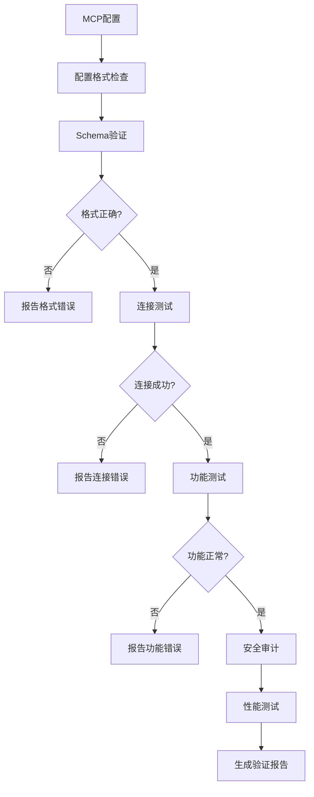
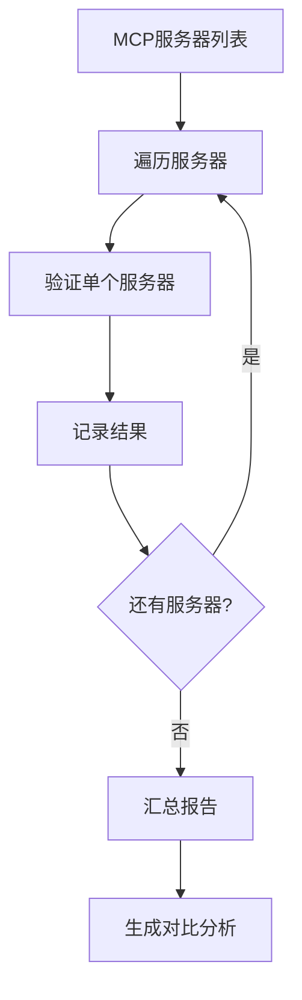
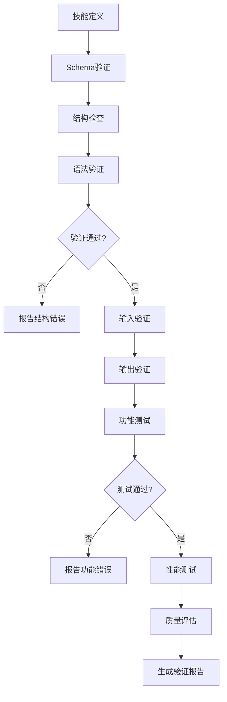
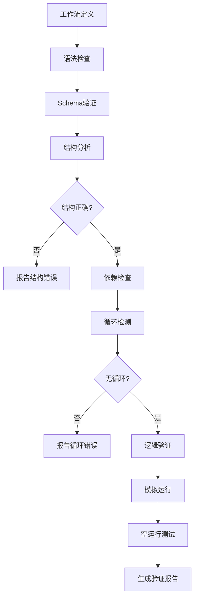
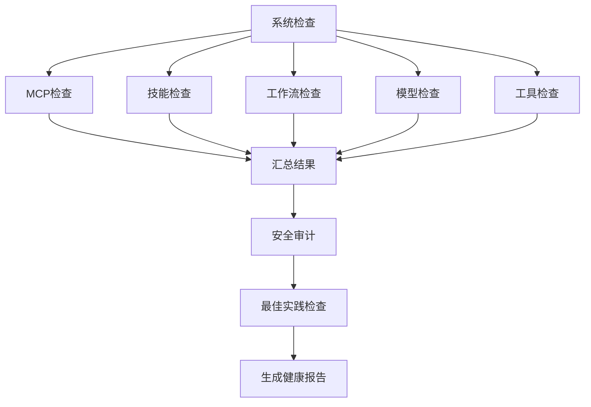

# Workflows 工作流 - 验证与检查

> 用于查验、验证、检查 MCP、技能、工作流等内容的工作流

---

## 🔍 MCP 验证工作流

### MCP 服务器完整验证流程



**工作流定义：**
```yaml
workflow:
  name: "MCPCompleteValidation"
  description: "MCP 服务器完整验证流程"
  type: "dag"
  
  steps:
    - id: "config_format_check"
      name: "配置格式检查"
      skill: "ConfigFormatChecker"
      input: "{{mcp_config_path}}"
      output: "format_check_result"
    
    - id: "schema_validation"
      name: "Schema 验证"
      skill: "MCPConfigValidator"
      input: "{{mcp_config_path}}"
      output: "schema_validation_result"
    
    - id: "format_gate"
      name: "格式检查门禁"
      skill: "ValidationGate"
      input: "{{schema_validation_result}}"
      condition: "{{schema_validation_result.is_valid}}"
      on_fail: "report_format_errors"
      on_pass: "connection_test"
    
    - id: "report_format_errors"
      name: "报告格式错误"
      skill: "ErrorReporter"
      input: "{{schema_validation_result.errors}}"
      output: "format_error_report"
      next: "end"
    
    - id: "connection_test"
      name: "连接测试"
      skill: "MCPConnectionChecker"
      input: "{{mcp_config.servers}}"
      output: "connection_results"
    
    - id: "connection_gate"
      name: "连接检查门禁"
      skill: "ValidationGate"
      input: "{{connection_results}}"
      condition: "{{connection_results.all_connected}}"
      on_fail: "report_connection_errors"
      on_pass: "function_test"
    
    - id: "report_connection_errors"
      name: "报告连接错误"
      skill: "ErrorReporter"
      input: "{{connection_results.failed}}"
      output: "connection_error_report"
      next: "end"
    
    - id: "function_test"
      name: "功能测试"
      skill: "MCPFunctionTester"
      input: "{{mcp_config.servers}}"
      output: "function_test_results"
    
    - id: "function_gate"
      name: "功能检查门禁"
      skill: "ValidationGate"
      input: "{{function_test_results}}"
      condition: "{{function_test_results.all_passed}}"
      on_fail: "report_function_errors"
      on_pass: "security_audit"
    
    - id: "report_function_errors"
      name: "报告功能错误"
      skill: "ErrorReporter"
      input: "{{function_test_results.failed}}"
      output: "function_error_report"
      next: "end"
    
    - id: "security_audit"
      name: "安全审计"
      skill: "MCPSecurityAuditor"
      input: "{{mcp_config}}"
      output: "security_report"
    
    - id: "performance_test"
      name: "性能测试"
      skill: "MCPPerformanceBenchmark"
      input: "{{mcp_config.servers}}"
      output: "performance_report"
    
    - id: "generate_report"
      name: "生成验证报告"
      skill: "ValidationReportGenerator"
      inputs:
        - "{{schema_validation_result}}"
        - "{{connection_results}}"
        - "{{function_test_results}}"
        - "{{security_report}}"
        - "{{performance_report}}"
      output: "complete_validation_report"
```

### MCP 批量验证流程



---

## 🧩 技能验证工作流

### 技能完整验证流程



**工作流定义：**
```yaml
workflow:
  name: "SkillCompleteValidation"
  description: "技能完整验证流程"
  type: "dag"
  
  steps:
    - id: "schema_validation"
      name: "Schema 验证"
      skill: "SkillSchemaValidator"
      input: "{{skill_definition}}"
      output: "schema_result"
    
    - id: "structure_check"
      name: "结构检查"
      skill: "SkillStructureChecker"
      input: "{{skill_definition}}"
      output: "structure_result"
    
    - id: "syntax_validation"
      name: "语法验证"
      skill: "SkillSyntaxValidator"
      input: "{{skill_definition}}"
      output: "syntax_result"
    
    - id: "validation_gate"
      name: "验证门禁"
      skill: "ValidationGate"
      inputs:
        - "{{schema_result}}"
        - "{{structure_result}}"
        - "{{syntax_result}}"
      condition: "all_passed"
      on_fail: "report_structure_errors"
      on_pass: "input_validation"
    
    - id: "report_structure_errors"
      name: "报告结构错误"
      skill: "ErrorReporter"
      inputs:
        - "{{schema_result.errors}}"
        - "{{structure_result.errors}}"
        - "{{syntax_result.errors}}"
      output: "structure_error_report"
      next: "end"
    
    - id: "input_validation"
      name: "输入验证"
      skill: "SkillInputValidator"
      input: "{{skill_definition.inputs}}"
      output: "input_validation_result"
    
    - id: "output_validation"
      name: "输出验证"
      skill: "SkillOutputChecker"
      input: "{{skill_definition.outputs}}"
      output: "output_validation_result"
    
    - id: "function_test"
      name: "功能测试"
      skill: "SkillFunctionTester"
      inputs:
        - "{{skill_definition}}"
        - "{{test_cases}}"
      output: "function_test_result"
    
    - id: "function_gate"
      name: "功能门禁"
      skill: "ValidationGate"
      input: "{{function_test_result}}"
      condition: "{{function_test_result.all_passed}}"
      on_fail: "report_function_errors"
      on_pass: "performance_test"
    
    - id: "report_function_errors"
      name: "报告功能错误"
      skill: "ErrorReporter"
      input: "{{function_test_result.failed_tests}}"
      output: "function_error_report"
      next: "end"
    
    - id: "performance_test"
      name: "性能测试"
      skill: "SkillPerformanceBenchmark"
      input: "{{skill_definition}}"
      output: "performance_result"
    
    - id: "quality_assessment"
      name: "质量评估"
      skill: "SkillQualityAssessor"
      inputs:
        - "{{skill_definition}}"
        - "{{function_test_result}}"
        - "{{performance_result}}"
      output: "quality_score"
    
    - id: "generate_report"
      name: "生成验证报告"
      skill: "ValidationReportGenerator"
      inputs:
        - "{{schema_result}}"
        - "{{structure_result}}"
        - "{{syntax_result}}"
        - "{{function_test_result}}"
        - "{{performance_result}}"
        - "{{quality_score}}"
      output: "complete_skill_validation_report"
```

### 技能批量验证流程

```yaml
workflow:
  name: "BatchSkillValidation"
  description: "批量验证多个技能"
  
  steps:
    - name: "扫描技能文件"
      skill: "SkillScanner"
      input: "{{skills_directory}}"
      output: "skill_files"
    
    - loop:
        name: "批量验证"
        iterator: "skill_file in {{skill_files}}"
        workflow: "SkillCompleteValidation"
        input: "{{skill_file}}"
        output: "validation_results"
    
    - name: "汇总结果"
      skill: "ValidationResultsAggregator"
      input: "{{validation_results}}"
      output: "batch_validation_report"
    
    - name: "生成对比分析"
      skill: "ValidationComparisonAnalyzer"
      input: "{{validation_results}}"
      output: "comparison_analysis"
```

---

## 🔄 工作流验证工作流

### 工作流完整验证流程



**工作流定义：**
```yaml
workflow:
  name: "WorkflowCompleteValidation"
  description: "工作流完整验证流程"
  type: "dag"
  
  steps:
    - id: "syntax_check"
      name: "语法检查"
      skill: "WorkflowSyntaxChecker"
      input: "{{workflow_definition}}"
      output: "syntax_result"
    
    - id: "schema_validation"
      name: "Schema 验证"
      skill: "WorkflowSchemaValidator"
      input: "{{workflow_definition}}"
      output: "schema_result"
    
    - id: "structure_analysis"
      name: "结构分析"
      skill: "WorkflowStructureAnalyzer"
      input: "{{workflow_definition}}"
      output: "structure_result"
    
    - id: "structure_gate"
      name: "结构门禁"
      skill: "ValidationGate"
      inputs:
        - "{{syntax_result}}"
        - "{{schema_result}}"
        - "{{structure_result}}"
      condition: "all_valid"
      on_fail: "report_structure_errors"
      on_pass: "dependency_check"
    
    - id: "report_structure_errors"
      name: "报告结构错误"
      skill: "ErrorReporter"
      inputs:
        - "{{syntax_result.errors}}"
        - "{{schema_result.errors}}"
        - "{{structure_result.errors}}"
      output: "structure_error_report"
      next: "end"
    
    - id: "dependency_check"
      name: "依赖检查"
      skill: "WorkflowDependencyChecker"
      input: "{{workflow_definition}}"
      output: "dependency_graph"
    
    - id: "cycle_detection"
      name: "循环检测"
      skill: "WorkflowCycleDetector"
      input: "{{dependency_graph}}"
      output: "cycle_detection_result"
    
    - id: "cycle_gate"
      name: "循环门禁"
      skill: "ValidationGate"
      input: "{{cycle_detection_result}}"
      condition: "{{cycle_detection_result.no_cycles}}"
      on_fail: "report_cycle_errors"
      on_pass: "logic_validation"
    
    - id: "report_cycle_errors"
      name: "报告循环错误"
      skill: "ErrorReporter"
      input: "{{cycle_detection_result.cycles}}"
      output: "cycle_error_report"
      next: "end"
    
    - id: "logic_validation"
      name: "逻辑验证"
      skill: "WorkflowLogicValidator"
      input: "{{workflow_definition}}"
      output: "logic_validation_result"
    
    - id: "simulation"
      name: "模拟运行"
      skill: "WorkflowSimulator"
      inputs:
        - "{{workflow_definition}}"
        - "{{test_inputs}}"
      output: "simulation_result"
    
    - id: "dry_run"
      name: "空运行测试"
      skill: "WorkflowDryRunner"
      input: "{{workflow_definition}}"
      output: "execution_plan"
    
    - id: "generate_report"
      name: "生成验证报告"
      skill: "ValidationReportGenerator"
      inputs:
        - "{{syntax_result}}"
        - "{{schema_result}}"
        - "{{structure_result}}"
        - "{{dependency_graph}}"
        - "{{cycle_detection_result}}"
        - "{{logic_validation_result}}"
        - "{{simulation_result}}"
        - "{{execution_plan}}"
      output: "complete_workflow_validation_report"
```

---

## 📊 综合验证工作流

### 系统完整健康检查



**工作流定义：**
```yaml
workflow:
  name: "SystemHealthCheck"
  description: "系统完整健康检查"
  type: "parallel"
  
  steps:
    - parallel:
        - id: "mcp_check"
          name: "MCP 健康检查"
          skill: "SystemHealthChecker"
          component: "mcp"
          output: "mcp_health"
        
        - id: "skills_check"
          name: "技能健康检查"
          skill: "SystemHealthChecker"
          component: "skills"
          output: "skills_health"
        
        - id: "workflows_check"
          name: "工作流健康检查"
          skill: "SystemHealthChecker"
          component: "workflows"
          output: "workflows_health"
        
        - id: "models_check"
          name: "模型健康检查"
          skill: "SystemHealthChecker"
          component: "models"
          output: "models_health"
        
        - id: "tools_check"
          name: "工具健康检查"
          skill: "SystemHealthChecker"
          component: "tools"
          output: "tools_health"
    
    - id: "aggregate_health"
      name: "汇总健康状态"
      skill: "HealthStatusAggregator"
      inputs:
        - "{{mcp_health}}"
        - "{{skills_health}}"
        - "{{workflows_health}}"
        - "{{models_health}}"
        - "{{tools_health}}"
      output: "aggregated_health"
    
    - id: "security_audit"
      name: "安全审计"
      skill: "SecurityAuditor"
      output: "security_audit_result"
    
    - id: "best_practice_check"
      name: "最佳实践检查"
      skill: "BestPracticeChecker"
      output: "best_practice_result"
    
    - id: "generate_health_report"
      name: "生成健康报告"
      skill: "HealthReportGenerator"
      inputs:
        - "{{aggregated_health}}"
        - "{{security_audit_result}}"
        - "{{best_practice_result}}"
      output: "complete_health_report"
```

### 配置诊断与修复

```yaml
workflow:
  name: "ConfigDiagnosisAndFix"
  description: "配置诊断与自动修复"
  
  steps:
    - name: "配置扫描"
      skill: "ConfigScanner"
      input: "{{config_directory}}"
      output: "config_files"
    
    - name: "配置诊断"
      skill: "ConfigDoctor"
      input: "{{config_files}}"
      output: "diagnosis_results"
    
    - name: "问题分类"
      skill: "IssueClassifier"
      input: "{{diagnosis_results.issues}}"
      output: "classified_issues"
    
    - name: "生成修复方案"
      skill: "AutoFixer"
      input: "{{classified_issues}}"
      output: "fix_proposals"
    
    - name: "应用修复"
      skill: "ConfigApplier"
      input: "{{fix_proposals}}"
      condition: "{{auto_apply}}"
      output: "applied_fixes"
    
    - name: "验证修复"
      skill: "ConfigValidator"
      input: "{{fixed_configs}}"
      output: "validation_result"
    
    - name: "生成诊断报告"
      skill: "DiagnosisReportGenerator"
      inputs:
        - "{{diagnosis_results}}"
        - "{{fix_proposals}}"
        - "{{applied_fixes}}"
        - "{{validation_result}}"
      output: "diagnosis_report"
```

---

## 📋 验证模板

### 快速验证模板

```yaml
template:
  name: "QuickValidation"
  description: "快速验证配置"
  
  parameters:
    - name: "config_path"
      type: "string"
      required: true
    
    - name: "config_type"
      type: "enum"
      options: ["mcp", "skill", "workflow", "model"]
      required: true
  
  workflow:
    - skill: "{{config_type}}Validator"
      input: "{{config_path}}"
    
    - skill: "QuickHealthChecker"
      input: "{{config_path}}"
```

### 深度验证模板

```yaml
template:
  name: "DeepValidation"
  description: "深度验证与测试"
  
  parameters:
    - name: "target"
      type: "string"
      required: true
    
    - name: "include_performance"
      type: "boolean"
      default: true
    
    - name: "include_security"
      type: "boolean"
      default: true
  
  workflow:
    - skill: "SchemaValidator"
      input: "{{target}}"
    
    - skill: "StructureChecker"
      input: "{{target}}"
    
    - skill: "FunctionTester"
      input: "{{target}}"
    
    - skill: "PerformanceBenchmark"
      input: "{{target}}"
      condition: "{{include_performance}}"
    
    - skill: "SecurityAuditor"
      input: "{{target}}"
      condition: "{{include_security}}"
    
    - skill: "ComprehensiveReportGenerator"
```

---

*持续更新中...*
